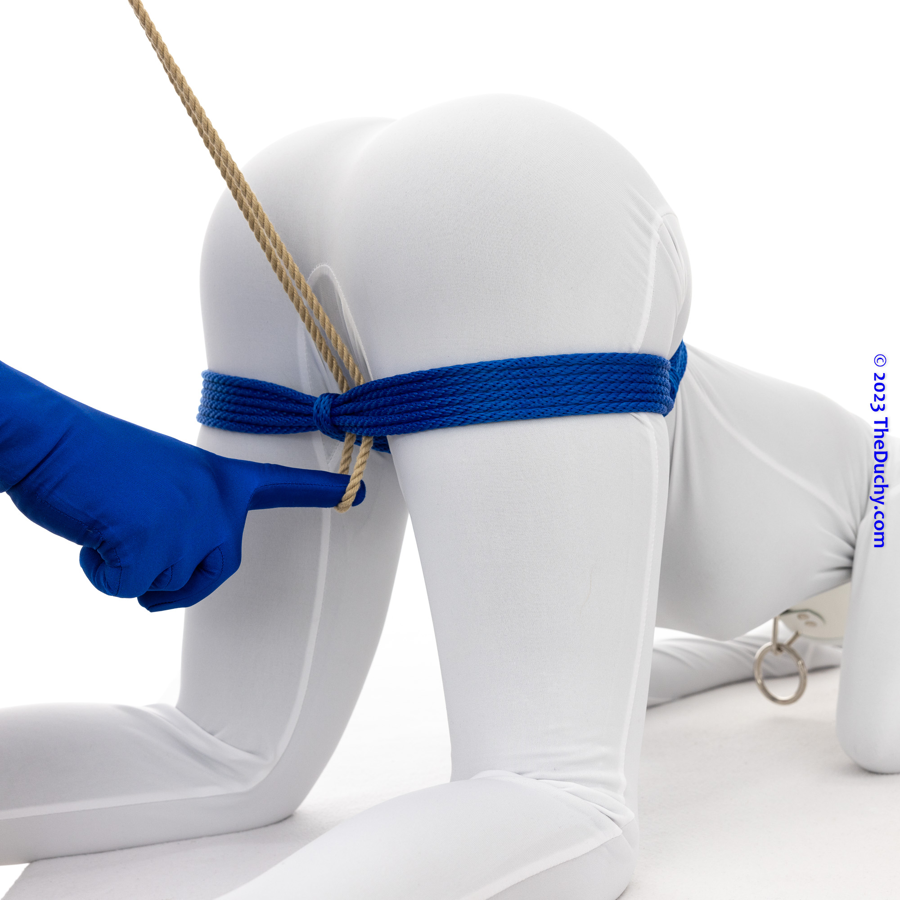
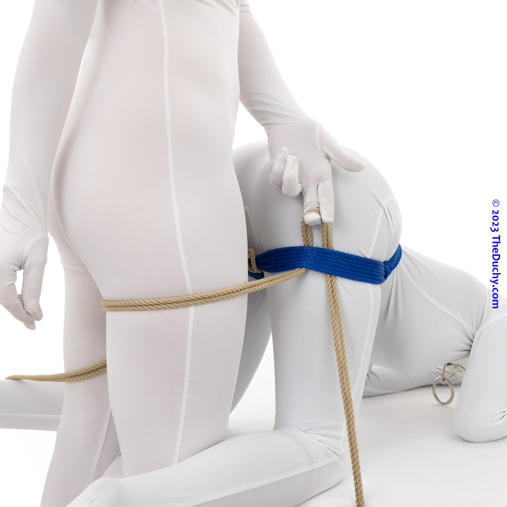

# [Mounting Harness - TheDuchy](img/#pics-extended-version)

<!-- vim-markdown-toc GFM -->

* [Simple Version](#simple-version)
* [Expanded Version](#expanded-version)

<!-- vim-markdown-toc -->

## Simple Version

-  1.  Begin with a Doggy Style Harness.
-  2.  Add a new rope to the inside of the cuff on each leg. To do so, run the bight under the cuff as shown…
-  3.  …reach through the bight to grab the tail…
-  4.  …pull the tail through and cinch the Lark’s Head tightly to the strap.
-  5.  First side complete.
-  6.  Do the same thing to add a second rope to the other side.
-  7.  Once you have both ropes added…
-  8.  …position yourself.
-  9.  The ropes should be running between your legs.
-  10.  Reach down and grab one of the ropes.
-  11.  Place your fingers underneath the thigh strap and hook the tail.
-  12.  Pull the tail through.
-  13.  Repeat on the other side.
-  14.  Bring both tails up and cross them over the top of your partner’s butt.
-  15.  Run each tail underneath the waist strap.
  - You can add a decorative twist here if you wish. (This is not shown in this picture, but you can see this in Step 6 of the Expanded Version below.)
-  16.  Bring the tails back at your waist level.
-  17.  Cross the tails behind the small of your back.
-  18.  Bring the tails forward again.
-  19.  Here you have a choice: (1) You could bring the tails up to the fronts and tie them around your waist placing a knot in front of your stomach, or…
-  20.  … (2) you can run them under the waistband at the middle of your partner’s back.
-  21.  If you choose this option, you have a fun little handle you can use to control how tightly your partner’s being pulled into you. Ride ‘em cowpoke!

## Expanded Version

-  1.  Start as you do in the version above, but this time place your Lark’s Head Knots to the outside of your partner’s thigh cuffs.
-  2.  Run the tails down through between the thigh cuffs and your partner closer to the center of the thigh straps, as shown. These will be the top of the straps going around your thighs.
-  3.  Make these loops large enough for you to step into.
-  4.  Step into the loops.
-  5.  Now run the tail up under the thigh straps, outside of the Lark’s Head Knot. Then pull out all the slack so that you are held tightly to your partner.
  - Using this technique, you now have four strands going around your legs instead of two, distributing the force and making things a bit more comfortable.
-  6.  Bring the tails up, cross them over the top of your partner’s butt and then run the tails underneath the waist strap just as you did in the Minimal Version.
  - This time Blue added a decorative twist mentioned in Step 15 of the Minimal Version above.
-  7.  Bring the tails back at your waist level.
-  8.  Cross the lines behind you.
  - (Optional) You can add a twist here for greater friction if you wish.
-  9.  Bring the tails forward from your waist and run them around the cinch strap that goes under your partner’s stomach in the Doggy Style Harness.
-  10.  It will look like this.
-  11.  Bring the tails back across them under your butt or at the small of your back (your choice).
-  12.  Bring the lines forward again, use up the rope, and tie it off. Here’s one way of doing that:
-  13.  (Optional) You can add crossing hitches to lines that you cross.
-  14.  Bring the tails forward and underneath the back of the waist strap of the Doggy Style Harness.
-  15.  Pull the tails to set the level of tightness you want.
-  16.  You can either hold onto these lines and can therefore can adjust tension throughout your scene, or you can tie them off.
